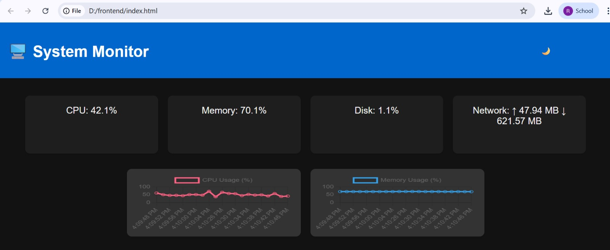

# System Monitor Web Application

A real-time web-based system monitoring dashboard that displays CPU usage, memory utilization, disk statistics, network activity, and a live process list.  
The backend is built using Python Flask and `psutil`, while the frontend uses HTML, CSS, and JavaScript.

---

## Features

- Real-time CPU usage
- RAM usage (total, used, percentage)
- Disk usage and storage statistics
- Network upload/download counters
- Live process table (PID, CPU%, Memory%)
- Auto-refresh every 1–2 seconds
- Lightweight REST API using Flask

---

## Tech Stack

| Layer | Technology |
|-------|------------|
| Frontend | HTML, CSS, JavaScript, Chart.js |
| Backend | Python, Flask |
| System Metrics | psutil |
| API | REST (JSON) |
| Optional Remote Access | ngrok |


## Backend Setup

```bash
cd backend
python -m venv venv
```

## Install dependencies:
```bash
pip install -r requirements.txt
```

Or manually:
```bash
pip install flask flask-cors psutil
```

## Run backend:
```bash
python app.py
```

The backend runs at:
```bash
http://127.0.0.1:5000
```

## Frontend Setup
```bash
cd ../frontend


Open index.html directly in your browser
or run:

python -m http.server 8000

Visit:

http://localhost:8000
```
## Connect Frontend to Backend

In your script.js, set:
```bash
const API_BASE = "http://127.0.0.1:5000";
```

Using ngrok:
```bash
ngrok http 5000
```

Then update:
```bash
const API_BASE = "https://your-ngrok-url.ngrok-free.app";
```
## API Endpoints
-GET /api/overview

Returns CPU, memory, disk, and network stats.

-GET /api/processes

Returns running processes sorted by CPU usage.

## Screenshots


